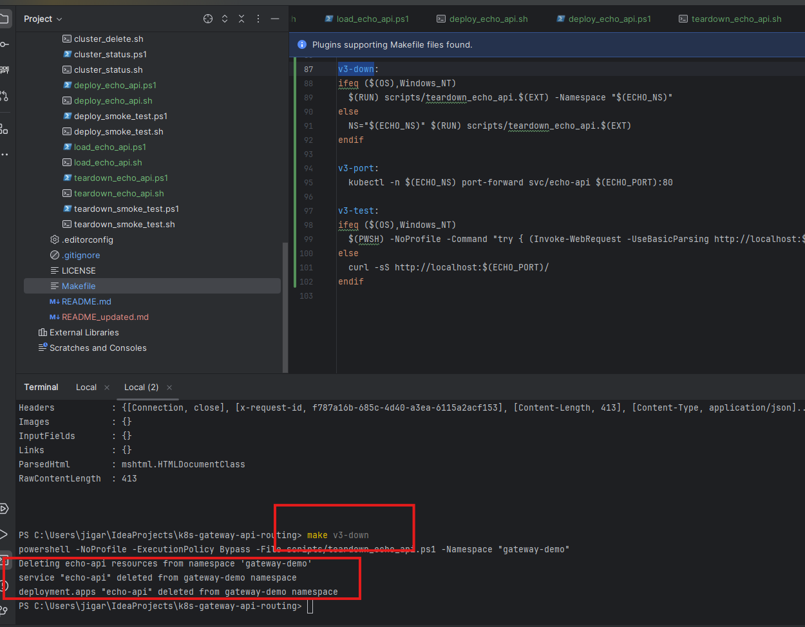

# echo-api

Tiny HTTP service used for routing/logging demos.

## What it does
- Returns request + pod metadata (useful for routing demos)
- Emits simple JSON logs to stdout (useful for logging demos)

## Endpoints
- `/` returns request + pod metadata and echoes an `x-request-id`
- `/healthz` liveness
- `/readyz` readiness

## Requirements

### Local Python run
- **Python 3.12+** recommended
- `pip` (comes with Python)
- Optional: `curl`

### Docker / Kubernetes run
- Docker Desktop (Windows/macOS) or Docker Engine (Linux)
- `kubectl`
- `kind`

Docker install docs:
- Windows: https://docs.docker.com/desktop/setup/install/windows-install/
- macOS: https://docs.docker.com/desktop/setup/install/mac-install/
- Linux: https://docs.docker.com/engine/install/

## Proof (v3)

> Screenshots of build → load → deploy → port-forward → validation → teardown




---

## Local run (no Docker)

### 1) Setup virtualenv + install deps
```bash
python --version
python -m venv .venv
# Windows: .venv\Scripts\activate
# macOS/Linux: source .venv/bin/activate
pip install -r requirements.txt
```

### 2) Run
```bash
python main.py
```

### 3) Test
```bash
curl http://localhost:8080/
curl -i http://localhost:8080/healthz
curl -i http://localhost:8080/readyz
```

---

## Docker (manual, no Kubernetes)

### 1) Build
From `apps/echo-api/`:
```bash
docker build -t echo-api:0.1.0 .
```

### 2) Run
```bash
docker run --rm -p 8080:8080 echo-api:0.1.0
```

### 3) Test
```bash
curl http://localhost:8080/
curl -i http://localhost:8080/healthz
```

---

## Kubernetes (kind) — manual commands

### 1) Build the image
From repo root:
```bash
docker build -t echo-api:0.1.0 apps/echo-api
```

### 2) Load into kind
```bash
kind load docker-image echo-api:0.1.0 --name gateway-demo
```

### 3) Deploy to Kubernetes
```bash
kubectl apply -k k8s/base
kubectl apply -k k8s/apps/echo-api
kubectl -n gateway-demo rollout status deploy/echo-api
kubectl -n gateway-demo get svc echo-api
```

### 4) Port-forward + test
```bash
kubectl -n gateway-demo port-forward svc/echo-api 8081:80
curl http://localhost:8081/
```

### 5) Teardown
```bash
kubectl delete -k k8s/apps/echo-api --ignore-not-found
```

---

## Kubernetes (kind) — using repo scripts

These do the same steps as above, but scripted.

### Windows (PowerShell)
From repo root:
```powershell
# Cluster
.\scripts\cluster_create.ps1 -ClusterName gateway-demo

# Build + load + deploy
.\scripts\build_echo_api.ps1 -Image "echo-api:0.1.0"
.\scripts\load_echo_api.ps1 -ClusterName "gateway-demo" -Image "echo-api:0.1.0"
.\scripts\deploy_echo_api.ps1 -ClusterName "gateway-demo" -Namespace "gateway-demo"

# Port-forward + test (run port-forward in its own terminal)
kubectl -n gateway-demo port-forward svc/echo-api 8081:80
curl http://localhost:8081/

# Teardown app
.\scripts\teardown_echo_api.ps1 -Namespace "gateway-demo"

# Cluster teardown (optional)
.\scripts\cluster_delete.ps1 -ClusterName gateway-demo
```

### macOS/Linux (bash)
From repo root:
```bash
# Cluster
bash scripts/cluster_create.sh gateway-demo

# Build + load + deploy
bash scripts/build_echo_api.sh
bash scripts/load_echo_api.sh gateway-demo
bash scripts/deploy_echo_api.sh gateway-demo

# Port-forward + test (run port-forward in its own terminal)
kubectl -n gateway-demo port-forward svc/echo-api 8081:80
curl http://localhost:8081/

# Teardown app
bash scripts/teardown_echo_api.sh

# Cluster teardown (optional)
bash scripts/cluster_delete.sh gateway-demo
```

---

## Kubernetes (kind) — with Make (optional)

### Windows/macOS/Linux
```powershell/bash
make cluster-up
make v3-up
make v3-port
# new terminal:
make v3-test
make v3-down
```
