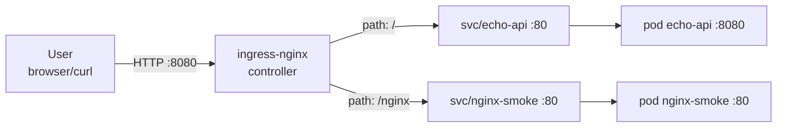

# Routing

This repo intentionally supports **two routing eras**:

- **Legacy routing (v4):** Kubernetes **Ingress** + `ingress-nginx`
- **Modern routing (v7):** **Gateway API** (Gateway + HTTPRoute)

The point is to have a clean baseline (v4) so the Gateway API upgrade (v7) is measurable and reviewable.

---

## v4 — Legacy routing (Ingress + ingress-nginx)

### What “legacy routing” means here
We use:
- `ingress-nginx` controller (installed into `ingress-nginx` namespace)
- Ingress rules in `gateway-demo` that route:
  - `/` → `echo-api` service
  - `/nginx` → `nginx-smoke` service (rewrite to `/`)

### Prereqs
You must have these running first:
- v1: `nginx-smoke` deployed
- v3: `echo-api` deployed

---

## Run v4 (recommended)

### With Make
```bash
make cluster-up
make v1-up
make v3-up
make v4-up
make v4-test
```

### Without Make (scripts)

#### Windows (PowerShell)
```powershell
.\scripts\cluster_create.ps1 -ClusterName gateway-demo
.\scripts\deploy_smoke_test.ps1

.\scripts\build_echo_api.ps1 -Image "echo-api:0.1.0"
.\scripts\load_echo_api.ps1 -ClusterName "gateway-demo" -Image "echo-api:0.1.0"
.\scripts\deploy_echo_api.ps1 -ClusterName "gateway-demo" -Namespace "gateway-demo"

.\scripts\ingress_nginx_install.ps1 -ClusterName gateway-demo
.\scripts\deploy_legacy_routing.ps1 -ClusterName gateway-demo -Namespace gateway-demo

.\scripts\test_legacy_routing.ps1
```

#### macOS/Linux (bash)
```bash
bash scripts/cluster_create.sh gateway-demo
bash scripts/deploy_smoke_test.sh

bash scripts/build_echo_api.sh
bash scripts/load_echo_api.sh gateway-demo
bash scripts/deploy_echo_api.sh gateway-demo

bash scripts/ingress_nginx_install.sh gateway-demo
bash scripts/deploy_legacy_routing.sh gateway-demo

bash scripts/test_legacy_routing.sh
```

---

## Validate (what “working” looks like)

> Windows note: PowerShell `curl` is an alias. Use `curl.exe` if you want consistent curl behavior.

```powershell
curl.exe -i http://localhost:8080/
curl.exe -i http://localhost:8080/nginx
```

Expected:
- `/` returns JSON from `echo-api`
- `/nginx` returns the nginx welcome HTML (via rewrite)

---

## Diagram (v4)



---

## Failure modes (v4)

### `404 Not Found` from nginx
Usually means:
- Ingress exists, but no rule matches the path, **or**
- The `echo-api` Ingress is missing.

Debug:
```bash
kubectl -n gateway-demo get ingress
kubectl -n gateway-demo describe ingress
```

### `503 Service Temporarily Unavailable`
Usually means:
- Ingress rule matched, but the backend has **no endpoints** (no ready pods).

Debug:
```bash
kubectl -n gateway-demo get endpoints echo-api nginx-smoke
kubectl -n gateway-demo get pods
kubectl -n gateway-demo rollout status deploy/echo-api
kubectl -n gateway-demo rollout status deploy/nginx-smoke
```

### Timeouts / connection refused
Usually means:
- controller not ready, or
- you’re on the wrong cluster context, or
- cluster was recreated and you’re hitting stale resources.

Debug:
```bash
kubectl config current-context
kind get clusters
kubectl -n ingress-nginx get pods
```

---

## Teardown (v4)
```bash
make v4-down
# optional full uninstall:
make v4-ingress-uninstall
```
