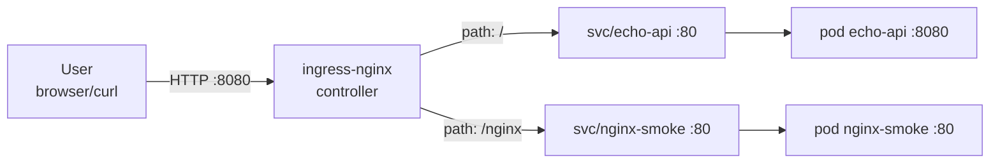
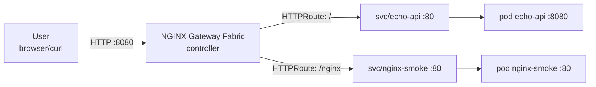

# Routing

This repo intentionally supports **two routing eras**:

- **Legacy routing (v4):** Kubernetes **Ingress** + `ingress-nginx`
- **Modern routing (v7):** **Gateway API** (Gateway + HTTPRoute)

The point is to have a clean baseline (v4) so the Gateway API upgrade (v7) is measurable and reviewable.

---

## v4 — Legacy routing (Ingress + ingress-nginx)

### What “legacy routing” means here
We use:
- `ingress-nginx` controller (installed into `ingress-nginx` namespace)
- Ingress rules in `gateway-demo` that route:
  - `/` → `echo-api` service
  - `/nginx` → `nginx-smoke` service (rewrite to `/`)

### Prereqs
v4 depends on:
- v1: `nginx-smoke` deployed
- v3: `echo-api` deployed

(If you run `make v4`, it brings those up automatically.)

---

## Run v4 (recommended)

### With Make

Terminal A (blocking):
```bash
make v4
make v4-port
```

Terminal B:
```bash
make v4-test
```

### Without Make (scripts)

#### Windows (PowerShell)
```powershell
.\scripts\cluster_create.ps1 -ClusterName gateway-demo
.\scripts\deploy_smoke_test.ps1

.\scriptsuild_echo_api.ps1 -Image "echo-api:0.1.0"
.\scripts\load_echo_api.ps1 -ClusterName "gateway-demo" -Image "echo-api:0.1.0"
.\scripts\deploy_echo_api.ps1 -ClusterName "gateway-demo" -Namespace gateway-demo

.\scripts\ingress_nginx_install.ps1 -ClusterName gateway-demo
.\scripts\deploy_legacy_routing.ps1 -ClusterName gateway-demo

# Terminal A (blocking):
kubectl -n ingress-nginx port-forward svc/ingress-nginx-controller 8080:80

# Terminal B:
.\scripts	est_legacy_routing.ps1
```

#### macOS/Linux (bash)
```bash
bash scripts/cluster_create.sh gateway-demo
bash scripts/deploy_smoke_test.sh

bash scripts/build_echo_api.sh
bash scripts/load_echo_api.sh gateway-demo
bash scripts/deploy_echo_api.sh gateway-demo

bash scripts/ingress_nginx_install.sh gateway-demo
bash scripts/deploy_legacy_routing.sh gateway-demo

# Terminal A (blocking):
kubectl -n ingress-nginx port-forward svc/ingress-nginx-controller 8080:80

# Terminal B:
bash scripts/test_legacy_routing.sh
```

---

## Verify routing (manual)

With the port-forward running (`make v4-port`), hit:

```bash
curl http://localhost:8080/
curl http://localhost:8080/nginx
```

Expected:
- `/` returns JSON from `echo-api`
- `/nginx` returns the nginx welcome HTML (via rewrite)

---

## Diagram (v4)


```mermaid
flowchart LR
  U[User\nbrowser/curl] -->|HTTP :8080| IN[ingress-nginx\ncontroller]

  IN -->|path: /| S1[svc/echo-api :80]
  IN -->|path: /nginx| S2[svc/nginx-smoke :80]

  S1 --> P1[pod echo-api :8080]
  S2 --> P2[pod nginx-smoke :80]
```

---

## Failure modes (v4)

### `404 Not Found` from nginx
Usually means:
- Ingress exists, but no rule matches the path, **or**
- The Ingress objects weren’t applied.

Debug:
```bash
kubectl -n gateway-demo get ingress
kubectl -n gateway-demo describe ingress
```

### `503 Service Temporarily Unavailable`
Usually means:
- Ingress rule matched, but the backend has **no ready endpoints** (no ready pods).

Debug:
```bash
kubectl -n gateway-demo get endpoints echo-api nginx-smoke
kubectl -n gateway-demo get pods
kubectl -n gateway-demo rollout status deploy/echo-api
kubectl -n gateway-demo rollout status deploy/nginx-smoke
```

### Timeouts / connection refused
Usually means:
- controller not ready, or
- you’re on the wrong cluster context, or
- the port-forward is not running.

Debug:
```bash
kubectl config current-context
kind get clusters
kubectl -n ingress-nginx get pods
```

---

## Teardown (v4)
```bash
make v4-down
# optional full uninstall:
make v4-ingress-uninstall
```

---

## v7 — Modern routing (Gateway API + NGINX Gateway Fabric)

### What "modern routing" means here
We use:
- **Gateway API CRDs** (standard channel) — the Kubernetes-native successor to Ingress
- **NGINX Gateway Fabric** controller (installed into `nginx-gateway` namespace) — same NGINX data plane, Gateway API native
- Gateway + HTTPRoute resources in `gateway-demo` that route:
  - `/` → `echo-api` service
  - `/nginx` → `nginx-smoke` service (with `URLRewrite` filter — no controller-specific annotations)

### Why NGINX Gateway Fabric?
- Same NGINX data plane already familiar from v4 — makes the migration story clean
- Official Gateway API conformant implementation
- Works on kind without extra config
- Keeps the "before/after" comparison meaningful (same proxy engine, different API)

### Prereqs
v7 depends on:
- v1: `nginx-smoke` deployed
- v3: `echo-api` deployed

(If you run `make v7`, it brings those up automatically.)

> **Note:** v7 does **not** depend on v4. They are parallel routing approaches.
> You can run v4 and v7 side by side, but only one port-forward at a time (`v4-port` or `v7-port`).

---

## Run v7 (recommended)

### With Make

Terminal A (blocking):
```bash
make v7
make v7-port
```

Terminal B:
```bash
make v7-test
```

### Without Make (scripts)

#### Windows (PowerShell)
```powershell
.\scripts\cluster_create.ps1 -ClusterName gateway-demo
.\scripts\deploy_smoke_test.ps1

.\scripts\build_echo_api.ps1 -Image "echo-api:0.1.0"
.\scripts\load_echo_api.ps1 -ClusterName "gateway-demo" -Image "echo-api:0.1.0"
.\scripts\deploy_echo_api.ps1 -ClusterName "gateway-demo" -Namespace gateway-demo

.\scripts\gateway_nginx_install.ps1 -ClusterName gateway-demo
.\scripts\deploy_gateway_routing.ps1 -ClusterName gateway-demo

# Terminal A (blocking):
kubectl -n nginx-gateway port-forward svc/nginx-gateway 8080:80

# Terminal B:
.\scripts\test_gateway_routing.ps1
```

#### macOS/Linux (bash)
```bash
bash scripts/cluster_create.sh gateway-demo
bash scripts/deploy_smoke_test.sh

bash scripts/build_echo_api.sh
bash scripts/load_echo_api.sh gateway-demo
bash scripts/deploy_echo_api.sh gateway-demo

bash scripts/gateway_nginx_install.sh gateway-demo
bash scripts/deploy_gateway_routing.sh gateway-demo

# Terminal A (blocking):
kubectl -n nginx-gateway port-forward svc/nginx-gateway 8080:80

# Terminal B:
bash scripts/test_gateway_routing.sh
```

---

## Verify routing (manual, v7)

With the port-forward running (`make v7-port`), hit:

```bash
curl http://localhost:8080/
curl http://localhost:8080/nginx
```

Expected:
- `/` returns JSON from `echo-api`
- `/nginx` returns the nginx welcome HTML (via URLRewrite filter)

---

## Diagram (v7)


```mermaid
flowchart LR
  U[User\nbrowser/curl] -->|HTTP :8080| NGF[NGINX Gateway Fabric\ncontroller]

  NGF -->|HTTPRoute: /| S1[svc/echo-api :80]
  NGF -->|HTTPRoute: /nginx| S2[svc/nginx-smoke :80]

  S1 --> P1[pod echo-api :8080]
  S2 --> P2[pod nginx-smoke :80]
```

---

## Legacy vs Gateway API comparison

| Aspect | v4 (Ingress) | v7 (Gateway API) |
|---|---|---|
| **API resource** | `Ingress` | `Gateway` + `HTTPRoute` |
| **Standardization** | Controller-specific annotations | Standardized spec across controllers |
| **Path rewriting** | `nginx.ingress.kubernetes.io/rewrite-target` annotation | `URLRewrite` filter (native, portable) |
| **Role model** | Single resource, one owner | Infra team owns Gateway, app team owns HTTPRoute |
| **Controller portability** | Behavior varies per controller | Conformance-tested, portable |
| **Extensibility** | Annotations (unstructured) | Typed filters + policy attachment |
| **Maturity** | Widely deployed, battle-tested | Newer, GA since v1.0 (Oct 2023) |
| **CRD install** | Not needed (built-in) | Required (`standard-install.yaml`) |

---

## Failure modes (v7)

### `404 Not Found`
Usually means:
- HTTPRoute exists, but no rule matches the path, **or**
- HTTPRoute is not attached to the Gateway.

Debug:
```bash
kubectl -n gateway-demo get httproute
kubectl -n gateway-demo describe httproute echo-api
kubectl -n gateway-demo describe gateway demo-gateway
```

### `503 Service Temporarily Unavailable`
Usually means:
- HTTPRoute matched, but the backend has **no ready endpoints** (no ready pods).

Debug:
```bash
kubectl -n gateway-demo get endpoints echo-api nginx-smoke
kubectl -n gateway-demo get pods
kubectl -n gateway-demo rollout status deploy/echo-api
kubectl -n gateway-demo rollout status deploy/nginx-smoke
```

### Gateway not Accepted / Programmed
Usually means:
- GatewayClass not recognized (controller not installed), or
- CRDs not installed.

Debug:
```bash
kubectl get gatewayclass
kubectl -n gateway-demo describe gateway demo-gateway
kubectl -n nginx-gateway get pods
kubectl -n nginx-gateway logs deploy/nginx-gateway-fabric
```

### Timeouts / connection refused
Usually means:
- Controller not ready, or
- Wrong cluster context, or
- Port-forward not running.

Debug:
```bash
kubectl config current-context
kind get clusters
kubectl -n nginx-gateway get pods
```

---

## Rollback (v7 → v4)

To switch back to legacy Ingress routing:
```bash
make v7-down
make v7-gateway-uninstall
make v4
make v4-port   # in separate terminal
make v4-test
```

---

## Teardown (v7)
```bash
make v7-down
# optional full uninstall:
make v7-gateway-uninstall
```

